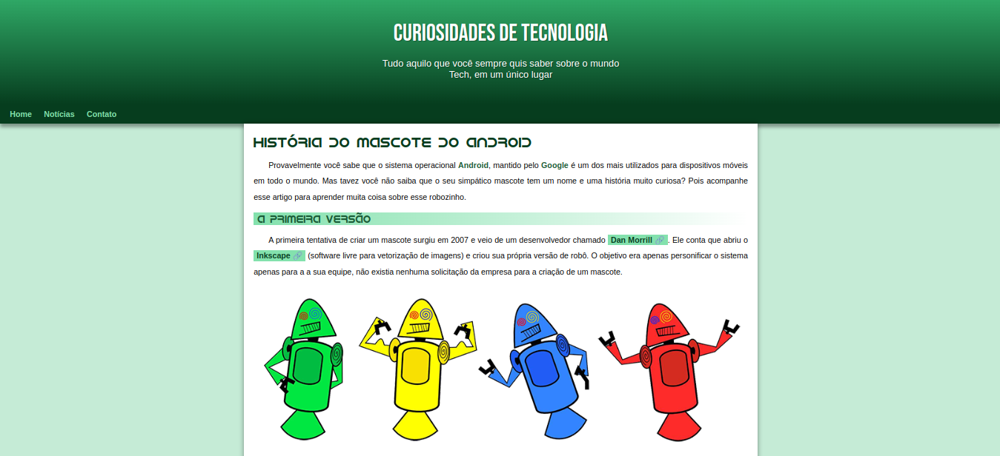

    

## 🖥️ Projeto
Este projeto foi desenvolvido nas aulas de HTML5 e CSS3 do [Cursoemvideo](https://www.cursoemvideo.com/) para contar a história do mascote do Android.

## 🚀 Tecnologias
Este projeto foi desenvolvido com as seguintes tecnologias:

- HTML
- CSS
- Git e Github